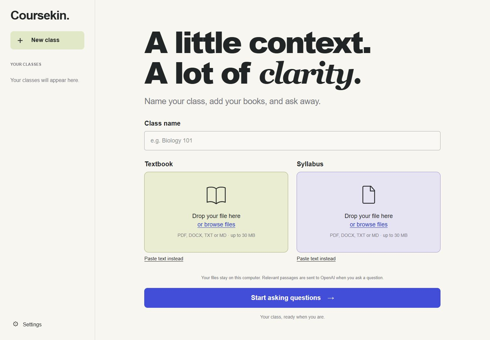

# Coursekin

Name your class. Add your textbook and syllabus. Start asking questions.

Coursekin helps you understand course material, practice a problem and check what your syllabus says. Answers can include references to the material used, so you can check the source yourself.

**[Visit Coursekin](https://coursekin.alx21.chatgpt.site)** · [OpenAI plugin](https://chatgpt.com/plugins/plugins_6aaa22656ccc8191902ee998a70c8a86) · [Download](https://github.com/agammann/coursekin/releases/latest) · [Get help](https://github.com/agammann/coursekin/issues)

## Choose your edition

| | OpenAI plugin | Local app |
| :--- | :--- | :--- |
| Best for | Studying in a compatible OpenAI host | A dedicated class workspace on your computer |
| Setup | Install the plugin, then attach your materials in a chat | Download, install Python and launch the app |
| API key | No separate API key | Your own OpenAI API key; API usage is billed separately |
| Materials and conversations | Handled by the host and its privacy settings | Extracted text and history stored on your computer |
| Answers | Uses the host model | Sends questions, recent conversation and selected excerpts to OpenAI |
| Start here | [Plugin guide](docs/plugin-guide.md) | [Local app guide](docs/local-app.md) |

The public OpenAI Sites website links to these two editions. Uploads and tutoring take place in the edition you choose. Classes do not automatically sync between them. The local app needs an internet connection for model answers.

## Start with the plugin

1. Open [Coursekin in the OpenAI plugin directory](https://chatgpt.com/plugins/plugins_6aaa22656ccc8191902ee998a70c8a86) and follow the install flow for your supported host.
2. Start a new chat with Coursekin. Give it your class name and attach or paste your textbook and syllabus.
3. Once it has read both, ask a question such as: “What does my syllabus say about grading? Show me the source.”

Host availability and attachment support can vary. See the [plugin guide](docs/plugin-guide.md) if the install option or your files are unavailable.

## Start with the local app

1. Install **Python 3.12 or newer** from [python.org](https://www.python.org/downloads/).
2. Open the [latest release](https://github.com/agammann/coursekin/releases/latest), download **`coursekin-local-source.zip`** from **Assets**, and extract the entire ZIP. Open its `coursekin` folder.
3. On **Windows**, double click **Start Coursekin.cmd**. On **macOS or Linux**, open a terminal in that folder and run `sh start.sh`.
4. On first launch, paste your own OpenAI API key into the private terminal prompt. Input is hidden. Keep the terminal open while using the app.
5. In the browser, name your class, add a textbook and syllabus, then select **Start asking questions**.

The launcher installs dependencies on first use and opens the local address `http://127.0.0.1:8767`. This address works only on your computer. If setup fails, follow the [operating system instructions and troubleshooting](docs/local-app.md).

*The custom workspace shown here belongs to the local app. The plugin uses its host’s chat interface.*

## Try a small practice class

Use the fictional textbook and syllabus in [Try Coursekin](docs/try-coursekin.md). You can paste both into either edition before trying your own materials. The guide includes questions and expected source facts.

After setup, try asking:

1. “Explain this idea using the textbook. Show me the relevant passage.”
2. “Give me one practice question and wait for my answer.”
3. “Check my reasoning and give me a hint for the next step.”

## What to expect

The local app accepts searchable PDF, DOCX, TXT, Markdown and pasted text. Each file must be under 30 MB, and a class can hold up to 20 documents. Both a textbook and a syllabus are required for initial local setup. See [formats and limits](docs/local-app.md#formats-and-limits) for extraction details.

Scanned PDFs need OCR first. Diagrams, tables and complex equations may not survive text extraction. Local retrieval uses keyword search; broad summaries can miss relevant sections. Check important claims against the original material and follow your class rules for AI assistance.

The local app stores extracted text and conversations, not the original uploaded file binaries. Keep your originals. **Course materials** lets you add documents, export a readable copy or delete a class. Exports cannot currently be imported back into Coursekin.

Your API key stays in the server environment or private `.env.local` file. Do not share that file, your class database or private exports. The local server is intended for one person and must not be exposed to the internet. Read [Privacy](PRIVACY.md) and [Security](SECURITY.md) for the exact boundaries.

## Guides and project information

| Guide | What it covers |
| :--- | :--- |
| [Local app](docs/local-app.md) | Installation, daily use, settings, backups and troubleshooting |
| [OpenAI plugin](docs/plugin-guide.md) | Installation, attachments and host limitations |
| [Try Coursekin](docs/try-coursekin.md) | Fictional materials and questions for a first session |
| [Development](docs/development.md) | Source setup, tests, configuration, packaging and contributions |
| [Verification](docs/verification.md) | Completed checks and remaining verification limits |
| [Plugin release](docs/plugin-release.md) | Publication record and proposed host acceptance cases |
| [Design references](docs/design-sources.md) | Visual research and attribution |

Automated tests and package builds run on Windows, Ubuntu and macOS in [GitHub Actions](https://github.com/agammann/coursekin/actions/workflows/checks.yml). Live local app checks on Windows and a fresh ChatGPT plugin tutoring session passed on September 19, 2026. Interactive macOS/Linux launches remain unverified; the [verification record](docs/verification.md) describes the completed checks and their limits.

For a bug or documentation correction, [open an issue](https://github.com/agammann/coursekin/issues) with your operating system, Python version, steps and a redacted error message. Use fictional material to reproduce file problems. Follow [private reporting instructions](SECURITY.md#reporting-a-vulnerability) for a security issue.

[MIT license](LICENSE) · [Privacy](PRIVACY.md) · [Usage information](TERMS.md)

Copyright 2026 Alexander Gregory Ammann. The license covers Coursekin code and original assets. Your uploaded materials retain their own rights.
