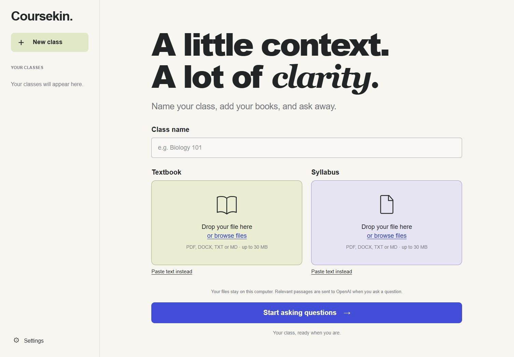

# Coursekin

Name your class. Add your textbook and syllabus. Ask questions with source passages you can open and check.

Coursekin helps you understand course material, practice a problem and check what your syllabus says. Its v1 source release includes three separate ways to study. Classes do not sync between them.

**[Open the browser workspace](https://coursekin.alx21.chatgpt.site)** · [Download](https://github.com/agammann/coursekin/releases/latest) · [Get help](https://github.com/agammann/coursekin/issues)

| Edition | Start here | Where answers run | Where your class is kept |
| :--- | :--- | :--- | :--- |
| Browser workspace | [Open Coursekin](https://coursekin.alx21.chatgpt.site) | Experimental Qwen 3 4B on your device, or OpenAI with your own key | This browser profile; export/import class backups |
| Python local app | Extract `coursekin-local-source.zip` | OpenAI with your own key; GPT-5.4 by default | SQLite on your computer; back up the stopped app's data folder |
| Host plugin | [Plugin directory](https://chatgpt.com/plugins/plugins_6aaa22656ccc8191902ee998a70c8a86), or source bundle in a supported host | The host's model and file tools | The host's chat and attachment controls |

Hosted answers use your own API billing. Device mode needs no account, API key or paid service; it needs a compatible WebGPU browser, graphics hardware, memory and storage. There is no automatic switch to paid answers. Check excerpts and calculations in every mode.

## Try the browser workspace

1. Open [Coursekin](https://coursekin.alx21.chatgpt.site), enter **Biology 101 practice** under **New class name** and select **Add class**.
2. Upload [biology-textbook.txt](examples/biology-textbook.txt) and [practice-syllabus.md](examples/practice-syllabus.md). These original fictional files are included in the source download.
3. Choose **On this device** and **Download model**, or choose **OpenAI with your key** and enter your key in the masked field. GPT-5.4 is the hosted default.
4. Ask: **“What percentage is the final exam worth? Show me the source.”** The syllabus says **40 percent**. Open the source beneath the answer and check its text.
5. Select **Export class backup**. Keep that JSON private. **Import class backup** creates another class containing its saved text and conversation.

The browser accepts searchable PDF, DOCX, TXT and Markdown, up to 25 MB and 600,000 extracted characters per file, with at most 1,500 PDF pages and 20 documents per class. Scanned PDFs need OCR first. Original upload binaries are not retained in backups.

Materials and conversation are saved in IndexedDB in this browser profile. Keep originals and a backup before clearing browser data or changing devices. Hosted mode sends your question, up to six selected excerpts and the last four messages through Coursekin to OpenAI. Its key stays in tab memory and clears on reload, leaving the page, **Clear key**, or switching to device mode. Backups exclude it. Read the [browser guide](web/README.md) for preview, cancellation and exact boundaries.

## Run the Python local app

1. Install **Python 3.12 or newer** from [python.org](https://www.python.org/downloads/).
2. Download **`coursekin-local-source.zip`** from the [release assets](https://github.com/agammann/coursekin/releases/latest), verify its SHA256 checksum and extract the entire archive. Open the `coursekin` folder.
3. On **Windows**, double click **Start Coursekin.cmd**. On **macOS or Linux**, open a terminal in that folder and run `sh start.sh`.
4. On first launch, enter your own OpenAI API key in the hidden terminal prompt. Keep that terminal open while using the app.
5. The launcher opens `http://127.0.0.1:8767`. Name your class, add a textbook and syllabus, then select **Start asking questions**. Upload the practice files above or paste their text.

The launcher creates its Python environment and installs pinned dependencies. The local app accepts searchable PDF, DOCX, TXT, Markdown and pasted text; its limits differ from the browser edition. Read the [local app guide](docs/local-app.md) for manual setup, formats, model configuration and troubleshooting.

Numbered citations open retrieved passages and their filename/location. A successful answer is saved with its source excerpts. **Course materials** lets you add documents, export a readable copy or delete a class. The readable export cannot be imported. For recovery or an upgrade, stop the server and privately copy the entire `data` folder, including any SQLite sidecar files. Restore that folder while the server is stopped. Keep originals separately.

## Use the host plugin

The [Coursekin plugin](https://chatgpt.com/plugins/plugins_6aaa22656ccc8191902ee998a70c8a86) supplies tutoring instructions to a compatible host. Give it your class name and attach or paste a textbook and syllabus. It should verify access to both before saying the class is ready, then cite verified source locations for course facts.

The release's `coursekin-plugin.zip` contains the instruction bundle, with no Coursekin server, account connection or API key. Local installation depends on the host. The public directory's published bundle remains version 0.1.0; v1 is the source release containing all three editions. Follow the [plugin guide](docs/plugin-guide.md) for installation and attachment limits. Availability, storage and access across conversations belong to the host.

## Check a first study session

The [practice guide](docs/try-coursekin.md) includes questions and source facts. The final exam is worth 40 percent, quizzes 20 percent and lab reports 40 percent. Scores of 70, 80 and 80 give **14 + 32 + 32 = 78 percent**. No late-work policy is supplied. Adding [exam-schedule.txt](examples/exam-schedule.txt) creates a deliberate conflict between June 11 and June 18; the answer should identify both sources and ask for clarification.

Retrieval uses keyword matching and can miss relevant sections. Extraction can lose diagrams, equations and tables. Source-reference checks reject unknown citation IDs; they do not prove support or correct reasoning. Ask specific questions, open excerpts and follow your class rules for assistance.

## Build on Coursekin

The [development guide](docs/development.md) covers source setup, checks and packaging. The browser uses plain JavaScript, IndexedDB and a Cloudflare Worker. The local app uses Python, SQLite and a separate JavaScript interface. The plugin consists of a manifest and tutoring guidance.

| Guide | Purpose |
| :--- | :--- |
| [Browser edition](web/README.md) | Preview, local models, visitor keys and backups |
| [Local app](docs/local-app.md) | Python setup, formats, recovery and configuration |
| [Host plugin](docs/plugin-guide.md) | Installation, source access and host limits |
| [Stability](STABILITY.md) | Supported v1 behavior and upgrades |
| [Verification](docs/verification.md) | Checks, provider observations and limits |
| [Third-party notices](THIRD_PARTY_NOTICES.md) | Library and model licenses |

For a bug, include your operating system, edition, versions, steps and a redacted error. Use fictional material to reproduce document problems. Do not post keys, private textbooks, databases or backups. See [Security](SECURITY.md) for private reporting.

[MIT license](LICENSE) · [Privacy](PRIVACY.md) · [Usage information](TERMS.md)

Copyright 2026 Alexander Gregory Ammann. The license covers Coursekin code and original assets. Uploaded materials and third-party components retain their own rights.
